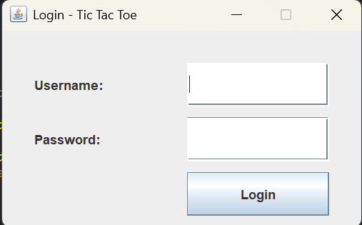
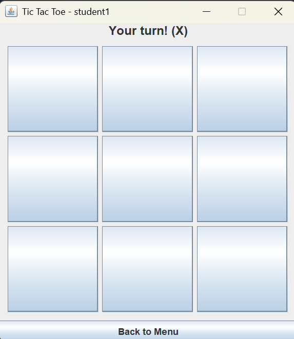
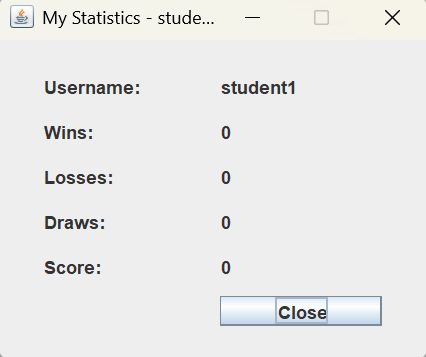
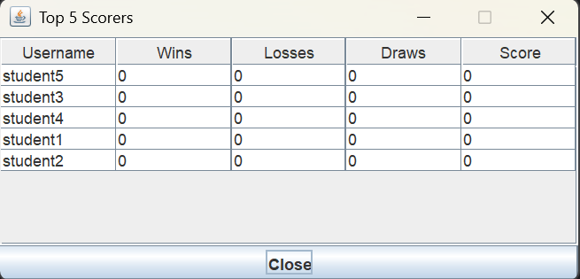

# Simple Tic-Tac-Toe Game with Java Swing, Login, and Statistics

## Student Information
Name        : Chandika Daffa Aqil Radhitya
Student ID  : 5026251066
Class       : A

## Project Description
This project is a simple Tic-Tac-Toe game application developed
using Java Swing as the graphical user interface. The application
was created as a small project for Programming Fundamental course.
The player competes against a computer that makes random moves,
giving the player a fair chance to win, lose, or draw. All player
data and game statistics are stored in a single PostgreSQL database
table.

## Features
- Login using database
- Play Tic-Tac-Toe using Swing GUI
- Record wins, losses, draws, and score
- Display personal statistics
- Display Top 5 scorers using JTable

## Database
Database used: PostgreSQL

## How to Create the Database
1. Open DBeaver.
2. Connect to your PostgreSQL server.
3. Run the following SQL to create the database:

```sql
CREATE DATABASE game_project;
```

4. Connect to game_project database, then run:

```sql
CREATE TABLE players (
    id SERIAL PRIMARY KEY,
    username VARCHAR(50) NOT NULL UNIQUE,
    password VARCHAR(100) NOT NULL,
    wins INT DEFAULT 0,
    losses INT DEFAULT 0,
    draws INT DEFAULT 0,
    score INT DEFAULT 0
);

INSERT INTO players (username, password, wins, losses, draws, score) VALUES ('student1', '12345', 0, 0, 0, 0);
INSERT INTO players (username, password, wins, losses, draws, score) VALUES ('student2', '12345', 0, 0, 0, 0);
INSERT INTO players (username, password, wins, losses, draws, score) VALUES ('student3', '12345', 0, 0, 0, 0);
INSERT INTO players (username, password, wins, losses, draws, score) VALUES ('student4', '12345', 0, 0, 0, 0);
INSERT INTO players (username, password, wins, losses, draws, score) VALUES ('student5', '12345', 0, 0, 0, 0);
```

## How to Run
1. Create the database.
2. Import schema.sql.
3. Open the Java project in Eclipse.
4. Add JDBC driver (postgresql-42.7.11.jar) to Build Path.
5. Configure DatabaseManager.java with your PostgreSQL password.
6. Run Main.java.

## Class Explanation
Main:
Starts the program and opens the Login Window using SwingUtilities.

DatabaseManager:
Handles JDBC database connection to PostgreSQL using DriverManager.

Player:
Stores player data such as id, username, wins, losses, draws,
and score with getter methods for each attribute.

PlayerService:
Handles login verification, updating player statistics after
each game, retrieving player data by id, and retrieving
Top 5 scorers from the database.

GameLogic:
Handles move validation, winner checking using eight win
patterns, draw checking, and random computer moves.

LoginFrame:
Swing window for username and password input with login
button event handling.

MainMenuFrame:
Swing window for the main menu with navigation buttons
to Start Game, My Statistics, Top 5 Scorers, and Exit.

GameFrame:
Swing window for playing Tic-Tac-Toe with nine buttons
representing the board cells and status label.

StatisticsFrame:
Swing window for showing personal statistics retrieved
from the database.

TopScorersFrame:
Swing window for showing Top 5 scorers using JTable
with data retrieved from the database.

## Screenshots
### Login Window


### Main Menu Window


### Game Window


### Statistics Window


### Top 5 Scorers Window


## Video Link
YouTube: [LINK YOUTUBE KAMU]

## GitHub Link
GitHub: [LINK GITHUB KAMU]
